# Component Diagram

## Full Component View

```mermaid
graph TB
    subgraph External["External Systems"]
        BROKER["Message Broker\n(Redpanda · Kafka · Iggy)\nselected via TEMPO_BROKER_BACKEND"]
        DS["Downstream Systems\n(payment engines, report generators, …)"]
    end

    subgraph Lib["tkone libraries"]
        SCHED["tkone-schedule\n(spec iterators)"]
        TRIG["tkone-trigger\n(in-process scheduler)"]
    end

    subgraph Tempo["Tempo Application"]
        subgraph Generation["Occurrence Generation"]
            OG["Occurrence Generator\n─────────────────\n• reads active defns\n• runs spec iterators\n• inserts occurrences\n• updates watermark"]
        end

        subgraph Firing["Claim and Fire"]
            OC["Occurrence Claimer\n─────────────────\n• SKIP LOCKED batch\n• atomic fire tx:\n  defn_run +\n  instance_runs +\n  outbox messages"]
            OP["Overlap / Dep\nPolicy Checker\n─────────────\n• ALLOW / SKIP /\n  BUFFER logic"]
        end

        subgraph Messaging["Messaging Pipeline"]
            OR["Outbox Relay\n──────────────\n• polls PENDING\n• publishes to broker\n• marks SENT / FAILED\n• retry with backoff"]
            IR["Inbox Relay\n──────────────\n• consumes topic\n• writes raw rows\n  to schedule_inbox"]
            IP["Inbox Processor\n──────────────\n• deduplicates\n  on correlation_id\n• updates instance_run\n• appends run events"]
        end

        subgraph Housekeeping["Housekeeping"]
            RA["Run Aggregator\n──────────────\n• reads run events\n• updates defn_run\n  rollup counters"]
            WC["Worker Coordinator\n──────────────\n• heartbeats\n• detects dead workers\n• resets stale leases"]
        end
    end

    subgraph DB["PostgreSQL"]
        subgraph DefnTables["Definition Tables"]
            T_DEFN[("schedule_defn\nschedule_defn_dep")]
            T_INST[("schedule_instance")]
            T_CAL[("calendar\ncalendar_holiday")]
        end

        subgraph OccTables["Occurrence Tables"]
            T_OCC[("schedule_occurrence")]
            T_WM[("occurrence_watermark")]
        end

        subgraph RunTables["Run Tables"]
            T_DR[("schedule_defn_run")]
            T_IR[("schedule_instance_run")]
            T_EVT[("schedule_defn_run_event")]
        end

        subgraph MsgTables["Messaging Tables"]
            T_OB[("schedule_outbox")]
            T_IB[("schedule_inbox")]
        end

        T_WORKER[("tempo_worker")]
    end

    %% Library → Generator
    SCHED -->|"spec iterators\n(Occurrence<T> stream)"| OG

    %% Generator → DB
    OG -->|"reads defns + watermark"| T_DEFN
    OG -->|"upserts occurrences"| T_OCC
    OG -->|"updates watermark"| T_WM

    %% Claimer → DB
    OC -->|"SKIP LOCKED batch claim"| T_OCC
    OC -->|"reads instances"| T_INST
    OC -->|"reads overlap / dep state"| T_DR
    OC <-->|"policy decision"| OP
    OC -->|"atomic tx: write"| T_DR
    OC -->|"atomic tx: write"| T_IR
    OC -->|"atomic tx: write"| T_OB

    %% Outbox Relay
    OR -->|"reads PENDING"| T_OB
    OR -->|"publishes"| BROKER
    OR -->|"marks SENT"| T_OB
    BROKER -->|"delivers"| DS

    %% Inbox path
    DS -->|"sends completion"| BROKER
    BROKER -->|"consumed by"| IR
    IR -->|"inserts raw message"| T_IB
    IP -->|"reads PENDING"| T_IB
    IP -->|"updates status"| T_IR
    IP -->|"appends event"| T_EVT
    IP -->|"marks PROCESSED"| T_IB

    %% Run Aggregator
    RA -->|"reads new events"| T_EVT
    RA -->|"updates rollup"| T_DR

    %% Coordinator
    WC -->|"heartbeats"| T_WORKER
    WC -->|"resets stale leases"| T_OCC
    WC -->|"marks dead workers"| T_WORKER
```



---

## Component Responsibilities in Detail

### Occurrence Generator

Owns the bridge between the pure-functional `tkone-schedule` iterators and the database. Runs on startup and then periodically (configurable cadence, e.g. every 15 minutes).

**Inputs:** `schedule_defn` rows with `state = 'ACTIVE'`, `schedule_occurrence_watermark`

**Outputs:** `schedule_occurrence` rows (upsert — safe to run multiple times), updated `schedule_occurrence_watermark`

**Invariant:** Never generates occurrences with `occurrence_dtm` earlier than the current watermark. Idempotent due to the unique constraint `(defn_id, defn_version, occurrence_dtm)`.

**Horizon config:** Two knobs control how far ahead to generate:
- `lookahead_duration` (e.g. `48h`) — wall-clock window
- `lookahead_count` (e.g. `500`) — maximum occurrences per definition

---

### Occurrence Claimer

The hot path. Multiple instances run in parallel, each assigned a non-overlapping `shard_key` range. Touches the database in tight loops.

**Claim query:**
```sql
UPDATE schedule_occurrence
SET    status = 'CLAIMED', claimed_by = $node_id,
       claimed_at = now(), lease_expires_at = now() + $lease_duration
WHERE  id IN (
    SELECT id FROM schedule_occurrence
    WHERE  status       = 'PENDING'
    AND    shard_key    % $shard_count = $shard_id
    AND    occurrence_dtm <= now()
    ORDER BY occurrence_dtm
    LIMIT  $batch_size
    FOR UPDATE SKIP LOCKED
)
RETURNING *;
```

**Fire transaction (per claimed occurrence):**
```
BEGIN
  -- check overlap policy against most recent defn_run for this defn
  -- check dep policy against depended-on defn_run status
  INSERT schedule_defn_run   (status=IN_PROGRESS)
  INSERT schedule_instance_run × N  (status=PENDING)
  INSERT schedule_outbox × N   (one per instance, unique correlation_id)
  UPDATE schedule_occurrence   (status=FIRED, fired_at=now())
COMMIT
```

If overlap/dep policy says SKIP or BUFFER, the occurrence is transitioned to that status and no outbox messages are written.

---

### Outbox Relay

Decouples the fire transaction from the network call. Runs as an independent async loop with configurable parallelism per topic.

**Poll query:**
```sql
SELECT id, topic, partition_key, payload, headers, correlation_id
FROM   schedule_outbox
WHERE  status = 'PENDING'
ORDER  BY created_at
LIMIT  $relay_batch_size
FOR UPDATE SKIP LOCKED;
```

**Retry policy:** Exponential backoff on `FAILED` rows. After `max_attempts`, the row stays `FAILED` and an alert fires — manual intervention required. This prevents a broken downstream from generating infinite noise.

---

### Inbox Relay + Inbox Processor

Split into two workers to decouple consumption speed from processing speed.

**Inbox Relay** writes raw Kafka / Iggy messages to `schedule_inbox` as fast as the broker can deliver them. No business logic.

**Inbox Processor** applies idempotency:
```sql
INSERT INTO schedule_inbox (…, status='PENDING')
ON CONFLICT (correlation_id) DO UPDATE SET status = 'DUPLICATE'
RETURNING status;
-- only proceed if status = 'PENDING' after the upsert
```

Then updates `schedule_instance_run` and appends the `schedule_defn_run_event`.

---

### Run Aggregator

Prevents hot-row contention on `schedule_defn_run`. Instead of each instance completion doing `UPDATE … SET completed_count = completed_count + 1`, completions append cheap event rows and the aggregator batches them:

```sql
-- Read a batch of unprocessed events
SELECT defn_run_id, event_type, count(*)
FROM   schedule_defn_run_event
WHERE  occurred_at > $last_processed_at
GROUP  BY defn_run_id, event_type;

-- Apply rollup
UPDATE schedule_defn_run
SET    completed_count = completed_count + $completed,
       failed_count    = failed_count    + $failed,
       status = CASE WHEN (completed_count + failed_count + …) = instance_count
                     THEN (CASE WHEN failed_count > 0 THEN 'FAILED' ELSE 'COMPLETED' END)
                     ELSE status END
WHERE  id = $defn_run_id;
```

---

### Worker Coordinator

Provides the distributed health model. Each Tempo process writes its own `tempo_worker` row and sends a heartbeat every N seconds (configurable, default 10s).

The coordinator (which can run on any worker — leader-elected via a DB advisory lock) scans for stale workers:

```sql
SELECT id, node_id FROM tempo_worker
WHERE  last_heartbeat < now() - interval '30 seconds'
AND    state = 'ACTIVE';
```

For each stale worker it:
1. Resets claimed occurrences back to `PENDING`
2. Marks the `tempo_worker` row as `DEAD`
3. Re-distributes the dead worker's shard range across surviving workers

---

## Broker Backend Abstraction

The Outbox Relay and Inbox Relay never call a broker SDK directly. They program against a `BrokerBackend` trait; a concrete implementation is injected at startup based on the `TEMPO_BROKER_BACKEND` environment variable.

```rust
pub trait BrokerBackend: Send + Sync + 'static {
    async fn publish(
        &self,
        topic:   &str,
        key:     Option<&str>,
        payload: &[u8],
        headers: &[(String, String)],
    ) -> Result<(), BrokerError>;

    fn subscribe(
        &self,
        topic:         &str,
        consumer_group: &str,
    ) -> impl Stream<Item = Result<BrokerMessage, BrokerError>> + Send;
}
```

Three implementations are planned:

| `TEMPO_BROKER_BACKEND` | Crate | Protocol | Notes |
|---|---|---|---|
| `redpanda` (default) | `rdkafka` | Kafka wire protocol | Redpanda is 100% Kafka-compatible; same code path as `kafka` |
| `kafka` | `rdkafka` | Kafka wire protocol | Identical implementation to `redpanda` — env var is informational |
| `iggy` | `iggy` | Iggy binary TCP | Separate implementation; same trait, different SDK |

**Kafka ↔ Redpanda** is a transparent swap — same `rdkafka` crate, same configuration, zero code difference. The `TEMPO_BROKER_BACKEND` value distinguishes them only for observability and logging.

**Iggy** requires its own `BrokerBackend` impl because it speaks a different wire protocol. The application logic in the Outbox Relay and Inbox Relay is identical regardless — they call `backend.publish(…)` and `backend.subscribe(…)` and never branch on broker type.

This design means adding a fourth broker (NATS, Pulsar, AWS SQS) is a matter of implementing the trait and wiring it to a new `TEMPO_BROKER_BACKEND` value — no changes to the relay workers or any other component.

---

## Deployment Topologies

### Single process (development / low volume)

All workers run as Tokio tasks inside one process. PostgreSQL connection pool size = 10–20.

### Horizontally scaled (production)

Each worker role can be scaled independently as separate pods / processes:

| Pod type | Suggested count | Shard assignment |
|---|---|---|
| `claimer` | 4–32 | Each pod owns `shard_lo..shard_hi` |
| `outbox-relay` | 2–8 | Partitioned by Kafka topic |
| `inbox-relay` | 2–4 | Partitioned by Kafka consumer group |
| `inbox-processor` | 2–8 | Stateless — any inbox row |
| `run-aggregator` | 1–2 | Stateless — uses SKIP LOCKED |
| `coordinator` | 1 (leader-elected) | DB advisory lock |
| `generator` | 1 (leader-elected) | DB advisory lock |
