# Entity-Relationship Diagram

The schema is centred on two independent hierarchies — **definitions** (the template) and **instances** (the subscriptions) — joined through **occurrences** (pre-generated fire points) and **runs** (execution records).

## Full ERD

```mermaid
erDiagram

    CALENDAR {
        uuid    id              PK
        varchar name            UK
        varchar timezone
        boolean is_default
        jsonb   business_hours
        enum    state
        ts      created_at
        ts      updated_at
    }

    CALENDAR_HOLIDAY {
        uuid    id          PK
        uuid    calendar_id FK
        varchar name
        ts      start_dtm
        ts      end_dtm
        ts      created_at
    }

    SCHEDULE_DEFN {
        uuid    id              "PK with version"
        int     version         "PK with id"
        varchar type
        varchar type_ref
        varchar name
        boolean one_off
        jsonb   run_spec
        uuid    calendar_id     FK
        enum    overlap_policy
        enum    dep_policy
        enum    state
        ts      effective_from
        ts      effective_to    "NULL = current"
        text    change_note
        ts      created_at
        varchar created_by
    }

    SCHEDULE_DEFN_DEP {
        uuid    defn_id                 FK
        int     defn_version            FK
        uuid    depends_on_defn_id      FK
        int     depends_on_defn_version FK
        enum    dep_policy
    }

    SCHEDULE_INSTANCE {
        uuid    id              PK
        uuid    defn_id         FK
        int     defn_version    FK
        varchar instance_ref
        boolean one_off
        jsonb   run_spec        "overrides defn run_spec"
        enum    overlap_policy
        enum    state
        ts      created_at
        ts      updated_at
    }

    SCHEDULE_OCCURRENCE {
        uuid        id              PK
        uuid        defn_id         FK
        int         defn_version    FK
        enum        kind            "EXACT | ADJUSTED_LATER | ADJUSTED_EARLIER"
        ts          actual_dtm      "raw calendar date"
        ts          occurrence_dtm  "settlement / observed date"
        smallint    shard_key       "computed: hash(defn_id) % 256"
        enum        status
        varchar     claimed_by
        ts          claimed_at
        ts          lease_expires_at
        ts          fired_at
        ts          created_at
    }

    SCHEDULE_OCCURRENCE_WATERMARK {
        uuid    defn_id             FK
        int     defn_version        FK
        ts      last_occurrence_dtm
        ts      updated_at
    }

    SCHEDULE_DEFN_RUN {
        uuid    id              PK
        uuid    defn_id         FK
        int     defn_version    FK
        uuid    occurrence_id   FK
        ts      actual_dtm      "denormalised"
        ts      occurrence_dtm  "denormalised"
        enum    status
        int     instance_count
        int     completed_count "async rollup"
        int     failed_count    "async rollup"
        ts      started_at
        ts      completed_at
        ts      created_at
    }

    SCHEDULE_INSTANCE_RUN {
        uuid    id              PK
        uuid    instance_id     FK
        uuid    defn_run_id     FK
        ts      occurrence_dtm  "denormalised"
        enum    status
        ts      started_at
        ts      completed_at
        text    error_message
        jsonb   metadata
        ts      created_at
    }

    SCHEDULE_DEFN_RUN_EVENT {
        uuid    id              PK
        uuid    defn_run_id     FK
        uuid    instance_run_id FK
        enum    event_type      "FIRED | COMPLETED | FAILED | SKIPPED | BUFFERED"
        ts      occurred_at
    }

    SCHEDULE_OUTBOX {
        uuid    id              PK
        ts      created_at
        varchar topic
        varchar partition_key
        jsonb   payload
        jsonb   headers
        enum    status
        int     attempts
        ts      last_attempt_at
        ts      sent_at
        varchar aggregate_type  "defn_run | instance_run"
        uuid    aggregate_id
        uuid    correlation_id  UK
    }

    SCHEDULE_INBOX {
        uuid    id              PK
        ts      received_at
        varchar topic
        varchar message_key
        jsonb   payload
        jsonb   headers
        uuid    correlation_id  UK
        enum    status
        uuid    instance_run_id FK
        ts      processed_at
        text    error_message
    }

    TEMPO_WORKER {
        uuid        id              PK
        varchar     node_id         UK  "k8s pod name (Downward API)"
        varchar     role
        smallint    shard_lo            "informational — derived from StatefulSet ordinal"
        smallint    shard_hi            "informational — derived from StatefulSet ordinal"
        integer     ordinal             "StatefulSet pod index; NULL for Deployment pods"
        ts          last_heartbeat
        ts          started_at
        varchar     state
    }

    CALENDAR            ||--o{ CALENDAR_HOLIDAY         : "has holidays"
    CALENDAR            ||--o{ SCHEDULE_DEFN            : "governs"
    SCHEDULE_DEFN       ||--o{ SCHEDULE_DEFN_DEP        : "has dependencies"
    SCHEDULE_DEFN       ||--o{ SCHEDULE_INSTANCE        : "subscribed as"
    SCHEDULE_DEFN       ||--o{ SCHEDULE_OCCURRENCE      : "generates"
    SCHEDULE_DEFN       ||--o{ SCHEDULE_OCCURRENCE_WATERMARK : "watermarked by"
    SCHEDULE_DEFN       ||--o{ SCHEDULE_DEFN_RUN        : "aggregated in"
    SCHEDULE_OCCURRENCE ||--|| SCHEDULE_DEFN_RUN        : "triggers"
    SCHEDULE_INSTANCE   ||--o{ SCHEDULE_INSTANCE_RUN    : "executed as"
    SCHEDULE_DEFN_RUN   ||--o{ SCHEDULE_INSTANCE_RUN    : "contains"
    SCHEDULE_DEFN_RUN   ||--o{ SCHEDULE_DEFN_RUN_EVENT  : "logged in"
    SCHEDULE_INSTANCE_RUN ||--o{ SCHEDULE_DEFN_RUN_EVENT : "emits"
    SCHEDULE_INSTANCE_RUN ||--o| SCHEDULE_INBOX         : "completed via"
```



---

## Key Design Notes

### Composite primary key on `SCHEDULE_DEFN`

`(id, version)` is the physical primary key. `id` is stable across the entire version history of a definition — it never changes. All foreign keys from instances, occurrences, and runs reference `(defn_id, defn_version)`, pinning each record to the exact version that was active at creation time.

A partial unique index enforces the single-active-version invariant without touching the PK:

```sql
CREATE UNIQUE INDEX defn_active_idx
    ON schedule_defn (type, type_ref, name) WHERE state = 'ACTIVE';
```

### `SCHEDULE_OCCURRENCE` — the distributed coordination pivot

This table is the meeting point between the spec iterator (which only knows about time) and the execution layer (which only knows about DB rows). The `shard_key` computed column (`abs(hashtext(defn_id::text)) % 256`) lets N workers each own a non-overlapping slice of the occurrence space without any inter-worker coordination.

The `lease_expires_at` column is the dead-worker recovery mechanism. If a worker claims a row but dies before firing it, the coordinator resets the row to `PENDING` after the lease window expires.

### `SCHEDULE_DEFN_RUN_EVENT` — async rollup decoupling

Rather than incrementing `completed_count` on `SCHEDULE_DEFN_RUN` synchronously with every instance run completion, completions append lightweight event rows. The Run Aggregator processes these in batches on a separate cadence. This removes the hot-row lock contention that would bottleneck at high instance fan-out (thousands of instances completing near-simultaneously for the same defn run).

### `TEMPO_WORKER` — Kubernetes identity model

`node_id` is the Kubernetes pod name, injected at runtime via the Downward API (`metadata.name`). It is unique within the single namespace Tempo is deployed into, and maps directly to `kubectl get pod` output for incident investigation.

`ordinal` is the StatefulSet pod index for claimer pods (e.g. `tempo-claimer-2` → ordinal `2`). Deployment pods (stateless roles) leave this `NULL`. `shard_lo` and `shard_hi` are computed from `ordinal` and the StatefulSet replica count at startup and stored here for observability — they are not authoritative for routing. The claimer derives its shard range at runtime from the `TEMPO_ORDINAL` environment variable.

See [kubernetes.md](kubernetes.md) for the full hosting design.

### `SCHEDULE_OUTBOX` + `SCHEDULE_INBOX` — exactly-once semantics

`correlation_id` on the outbox is generated at write time and echoed in the Kafka / Iggy message payload. The inbox carries the same value. A unique index on `schedule_inbox.correlation_id` ensures that even if the broker re-delivers a message (outbox relay crash after publish but before `SENT` mark), the second insertion fails on the unique constraint and the processor treats it as `DUPLICATE`.
