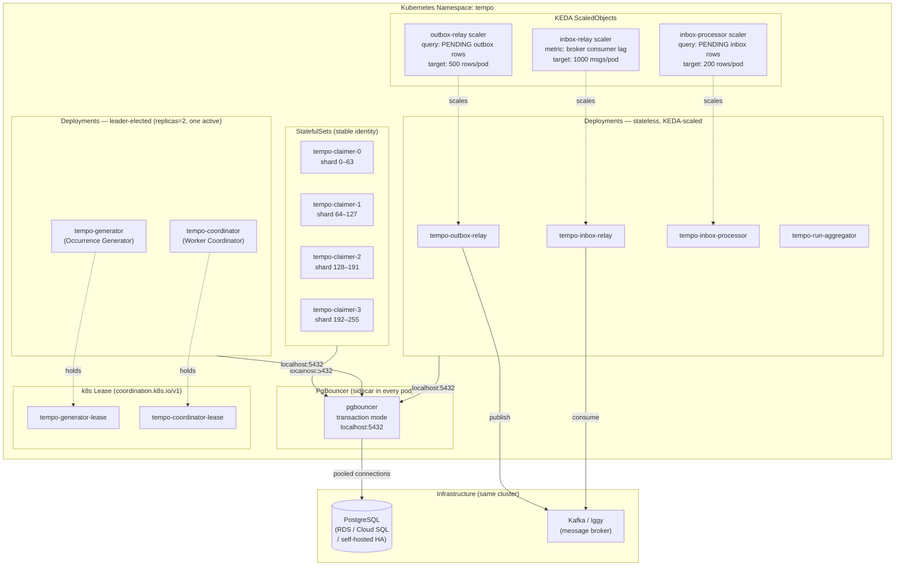

# Kubernetes Hosting — Architecture and Design Decisions

Tempo is deployed as a collection of single-purpose workloads inside **one Kubernetes cluster, one namespace**. Each workload maps to exactly one of the internal component roles. Workers that need stable identity use StatefulSets; stateless workers use Deployments with event-driven autoscaling.

---

## Contents

- [Deployment Topology](#deployment-topology)
- [Workload Mapping](#workload-mapping)
- [Design Decisions](#design-decisions)
  - [StatefulSet ordinals for shard assignment](#1-statefulset-ordinals-for-shard-assignment)
  - [Kubernetes Lease for leader election](#2-kubernetes-lease-for-leader-election)
  - [SIGTERM and graceful drain](#3-sigterm-and-graceful-drain)
  - [PgBouncer sidecar for connection pooling](#4-pgbouncer-sidecar-for-connection-pooling)
  - [KEDA for event-driven autoscaling](#5-keda-for-event-driven-autoscaling)
  - [Readiness probe gates claim eligibility](#6-readiness-probe-gates-claim-eligibility)
  - [Pod identity via Downward API](#7-pod-identity-via-downward-api)
- [Schema Addition](#schema-addition)
- [Resource Sizing Reference](#resource-sizing-reference)

---

## Deployment Topology



---

## Workload Mapping

| Component | Workload kind | Replicas | Reason |
|---|---|---|---|
| Occurrence Claimer | **StatefulSet** | 4 → 32 (manual scale) | Needs stable pod name for shard ownership and dead-worker detection |
| Occurrence Generator | **Deployment** | 2 (one active via Lease) | Single logical writer; second pod is hot standby for fast failover |
| Worker Coordinator | **Deployment** | 2 (one active via Lease) | Same — must be single writer to avoid race on lease recovery |
| Outbox Relay | **Deployment** | 1 → N (KEDA) | Stateless; scales on outbox queue depth |
| Inbox Relay | **Deployment** | 1 → N (KEDA) | Stateless; scales on broker consumer lag |
| Inbox Processor | **Deployment** | 1 → N (KEDA) | Stateless; scales on inbox queue depth |
| Run Aggregator | **Deployment** | 1–2 | Low volume; `SKIP LOCKED` handles concurrency safely |

---

## Design Decisions

### 1. StatefulSet ordinals for shard assignment

**Decision:** Claimer workers are deployed as a StatefulSet. Each pod derives its shard slice from its ordinal index and the current replica count — no coordinator involvement, no database-managed range assignment.

```
shard_id    = pod ordinal          (0, 1, 2, …, N-1)
shard_count = StatefulSet replicas (injected via Downward API)
owns rows:  WHERE shard_key % shard_count = shard_id
```

Each pod writes its computed shard range to `tempo_worker` on startup (informational — for observability and debugging, not for routing).

**Why StatefulSet over Deployment:**
A Deployment assigns no stable identity to pods; a `SKIP LOCKED` shard filter based on `pod-<random>` would require a coordinator to maintain a mapping. StatefulSet ordinals are deterministic, stable across restarts, and free of any coordination overhead.

**Scaling behaviour:** When replicas change from N to M:
- Scale-up: new pod-M starts, claims the shard slice `M % (N+1) = M` — immediately active.
- Scale-down: Kubernetes terminates the highest-ordinal pod first; its leases expire naturally within `lease_expires_at`; the coordinator reclaims any in-flight occurrences.

There is a brief window during rescale where shard coverage is uneven. This is safe: `lease_expires_at` ensures no occurrence is permanently lost, and `SKIP LOCKED` prevents double-claiming.

---

### 2. Kubernetes Lease for leader election

**Decision:** The Generator and Coordinator each hold a `coordination.k8s.io/v1` Lease object. Only the pod currently holding the lease executes the role; the standby pod idles until the lease expires.

```yaml
apiVersion: coordination.k8s.io/v1
kind: Lease
metadata:
  name: tempo-generator-lease
  namespace: tempo
spec:
  leaseDurationSeconds: 15
  renewTime: <updated by holder every ~5s>
  holderIdentity: <pod name>
```

**Why k8s Lease over PostgreSQL advisory lock:**

| Concern | PostgreSQL advisory lock | k8s Lease |
|---|---|---|
| Lock release on pod death | Only when DB session drops (may lag) | Automatic on TTL expiry (~15s) |
| Failover speed | Depends on TCP keepalive + `statement_timeout` | Configurable TTL — typically 15s |
| Infrastructure dependency | Already required | Already required (k8s API server) |
| Debugging | Requires DB query | `kubectl get lease -n tempo` |

The Rust `kube` crate (`kube::runtime::controller` + `kube_leader_election`) provides a ready-made implementation. Both Generator and Coordinator pods run the lease-election loop; the one that wins proceeds, the other parks in a watch loop.

RBAC required for the pod's ServiceAccount:

```yaml
rules:
  - apiGroups: ["coordination.k8s.io"]
    resources: ["leases"]
    verbs: ["get", "create", "update", "patch"]
```

---

### 3. SIGTERM and graceful drain

**Decision:** Every worker handles `SIGTERM` (the signal Kubernetes sends before `SIGKILL`) with a role-appropriate drain sequence. `SIGINT` (Ctrl-C) triggers the same path for local development parity.

```rust
let mut sigterm = signal(SignalKind::terminate())?;
let mut sigint  = signal(SignalKind::interrupt())?;

tokio::select! {
    _ = sigterm.recv() => {}
    _ = sigint.recv()  => {}
}
// shared shutdown token cancel propagates to all worker tasks
```

**Drain sequence per role:**

| Role | Drain behaviour |
|---|---|
| Claimer | Mark `tempo_worker.state = DRAINING`; finish current batch; do not start new claims; exit. |
| Generator | Release k8s Lease; standby pod acquires within TTL. |
| Coordinator | Release k8s Lease. |
| Outbox Relay | Finish current publish batch; exit. |
| Inbox Relay | Commit current Kafka offset batch; exit. |
| Inbox Processor | Finish current inbox batch; exit. |
| Run Aggregator | Finish current event batch; exit. |

`terminationGracePeriodSeconds` is set per workload based on worst-case drain time:

```yaml
# Claimer — may be mid-transaction on a large instance fan-out
spec:
  terminationGracePeriodSeconds: 120

# Stateless relay/processor — batch is small and fast
spec:
  terminationGracePeriodSeconds: 30
```

Kubernetes waits `terminationGracePeriodSeconds` after SIGTERM before sending SIGKILL. The application must exit within this window. Any occurrence left unclaimed after a claimer drains will have its lease expired by the Coordinator and re-queued automatically.

---

### 4. PgBouncer sidecar for connection pooling

**Decision:** Every pod runs a PgBouncer container in the same pod (sidecar pattern). The application connects to `localhost:5432`; PgBouncer holds a bounded server-side pool to PostgreSQL.

**Why sidecar over a shared PgBouncer Deployment:**
A shared PgBouncer service is a single point of failure and a network hop. A sidecar has no SPOF and zero network latency for the pool handshake. If the PgBouncer sidecar dies, Kubernetes restarts the whole pod (both containers share a lifecycle), which is the correct behaviour — a pod without a DB proxy is non-functional.

**Mode: transaction pooling**

```ini
# pgbouncer.ini
pool_mode = transaction
max_client_conn = 200
default_pool_size = 5        ; server-side connections per database/user pair
reserve_pool_size = 2
server_idle_timeout = 60
```

Transaction mode is required because `SKIP LOCKED` and `SELECT FOR UPDATE` are single-statement operations — they do not hold a server connection across multiple round-trips. Session mode would negate the pooling benefit.

**Connection budget across the cluster:**

```
32 claimer pods × 5 server conns  = 160
8  relay/processor pods × 5       =  40
2  generator/coordinator pods × 3 =   6
─────────────────────────────────────────
Max server-side connections        = 206
```

PostgreSQL `max_connections = 250` is sufficient headroom. Adjust `default_pool_size` as replica counts change.

---

### 5. KEDA for event-driven autoscaling

**Decision:** Relay and processor Deployments are scaled by KEDA ScaledObjects backed by PostgreSQL queries, not by CPU/memory HPA.

**Why KEDA over HPA:**
CPU usage of a relay worker polling an empty outbox is near zero — HPA would never scale up. The signal that matters is queue depth, which is a DB row count. KEDA's PostgreSQL scaler queries the DB directly on a configurable interval and adjusts replica count before the queue grows unbounded.

```yaml
# Outbox Relay ScaledObject
apiVersion: keda.sh/v1alpha1
kind: ScaledObject
metadata:
  name: tempo-outbox-relay
  namespace: tempo
spec:
  scaleTargetRef:
    name: tempo-outbox-relay
  minReplicaCount: 1
  maxReplicaCount: 16
  triggers:
    - type: postgresql
      metadata:
        query: >
          SELECT COUNT(*)
          FROM schedule_outbox
          WHERE status = 'PENDING'
        targetQueryValue: "500"
        connectionStringFromEnv: TEMPO_DB_URL
```

```yaml
# Inbox Processor ScaledObject
spec:
  minReplicaCount: 1
  maxReplicaCount: 16
  triggers:
    - type: postgresql
      metadata:
        query: >
          SELECT COUNT(*)
          FROM schedule_inbox
          WHERE status = 'PENDING'
        targetQueryValue: "200"
        connectionStringFromEnv: TEMPO_DB_URL
```

```yaml
# Inbox Relay ScaledObject — scales on broker consumer lag
spec:
  minReplicaCount: 1
  maxReplicaCount: 8
  triggers:
    - type: kafka           # or apache-kafka / aws-sqs depending on broker
      metadata:
        topic: tempo-schedule-completions
        consumerGroup: tempo-inbox-relay
        lagThreshold: "1000"
```

`minReplicaCount: 1` ensures one relay pod is always running even when the queue is empty (avoids cold-start latency on a sudden burst).

---

### 6. Readiness probe gates claim eligibility

**Decision:** Each pod exposes a `/healthz/ready` endpoint that returns `200` only after the DB connection pool is warm and the `tempo_worker` row is successfully inserted. Kubernetes will not route traffic to — or, more importantly for Tempo, consider the pod schedulable for work — until the probe passes.

This prevents a half-started claimer from winning a `SKIP LOCKED` race it cannot complete (which would burn a lease window unnecessarily).

```yaml
readinessProbe:
  httpGet:
    path: /healthz/ready
    port: 8080
  initialDelaySeconds: 5
  periodSeconds: 5
  failureThreshold: 3

livenessProbe:
  httpGet:
    path: /healthz/live
    port: 8080
  periodSeconds: 10
  failureThreshold: 6      # allow up to 60s before restart
```

The liveness probe stays `200` throughout normal operation including graceful drain. It only returns `503` if the process is wedged (deadlock, panic recovery). This avoids Kubernetes killing a pod that is actively draining a batch.

---

### 7. Pod identity via Downward API

**Decision:** `tempo_worker.node_id` is set to the Kubernetes pod name, injected at runtime via the Downward API. It is unique within the namespace and directly correlates to `kubectl get pod` output — no custom mapping required for incident investigation.

```yaml
env:
  - name: TEMPO_NODE_ID
    valueFrom:
      fieldRef:
        fieldPath: metadata.name
  - name: TEMPO_ORDINAL            # StatefulSet pods only
    valueFrom:
      fieldRef:
        fieldPath: metadata.labels['apps.kubernetes.io/pod-index']
```

`TEMPO_ORDINAL` is the StatefulSet pod index label (available since Kubernetes 1.28). Older clusters can parse the ordinal from `TEMPO_NODE_ID` by splitting on `-` and taking the last segment.

---

## Schema Addition

The only schema change driven by Kubernetes (beyond what is already defined in [schema.sql](schema.sql)):

```sql
-- Informational: records the pod's StatefulSet ordinal for shard debugging.
-- Not used for routing — ordinal is derived at runtime from TEMPO_ORDINAL env var.
ALTER TABLE tempo_worker
    ADD COLUMN ordinal integer;
```

`k8s_namespace` is intentionally omitted — single namespace deployment makes it a constant, not a useful discriminator.

---

## Resource Sizing Reference

Starting point for a production cluster. Tune based on observed `schedule_occurrence` claim throughput and outbox/inbox queue depths.

| Workload | CPU request | CPU limit | Memory request | Memory limit |
|---|---|---|---|---|
| tempo-claimer | 250m | 1000m | 128Mi | 512Mi |
| tempo-generator | 100m | 500m | 64Mi | 256Mi |
| tempo-coordinator | 100m | 250m | 64Mi | 128Mi |
| tempo-outbox-relay | 100m | 500m | 64Mi | 256Mi |
| tempo-inbox-relay | 100m | 500m | 64Mi | 256Mi |
| tempo-inbox-processor | 100m | 500m | 64Mi | 256Mi |
| tempo-run-aggregator | 100m | 250m | 64Mi | 128Mi |
| pgbouncer (sidecar) | 50m | 200m | 32Mi | 64Mi |

**PodDisruptionBudget for claimers** — ensures at least `N-1` pods are available during rolling updates or node drains:

```yaml
apiVersion: policy/v1
kind: PodDisruptionBudget
metadata:
  name: tempo-claimer-pdb
  namespace: tempo
spec:
  maxUnavailable: 1
  selector:
    matchLabels:
      app: tempo-claimer
```
