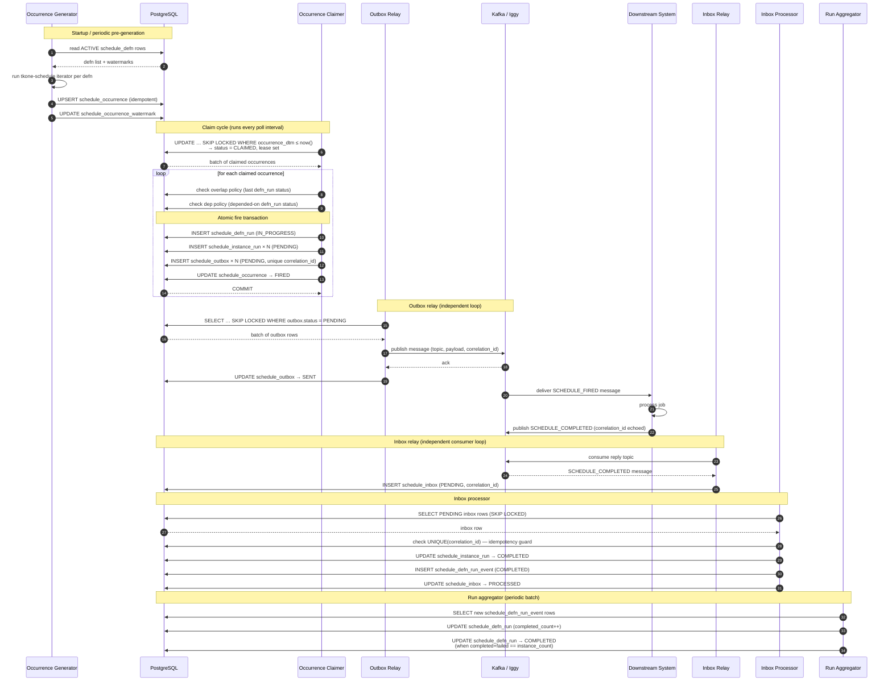
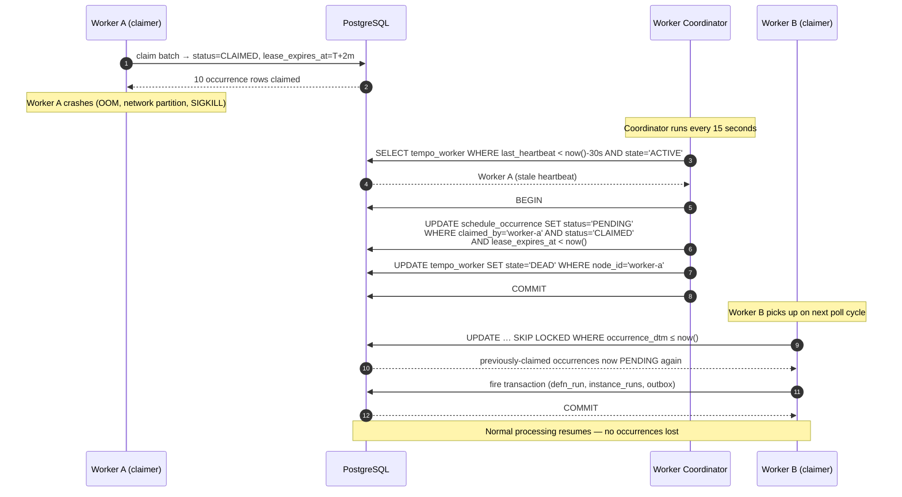
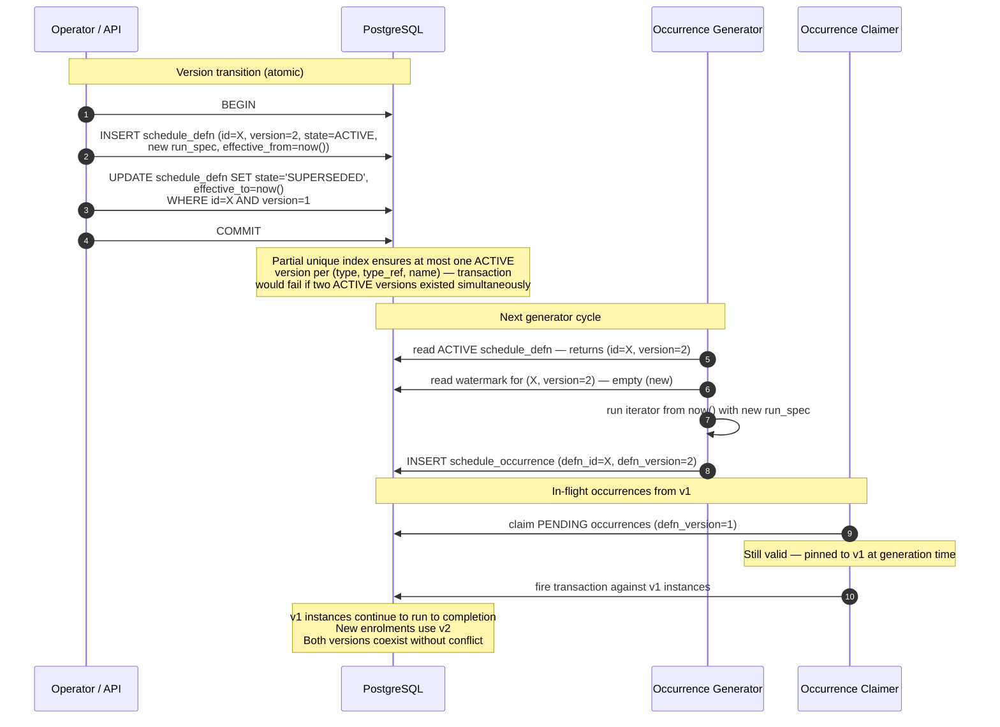
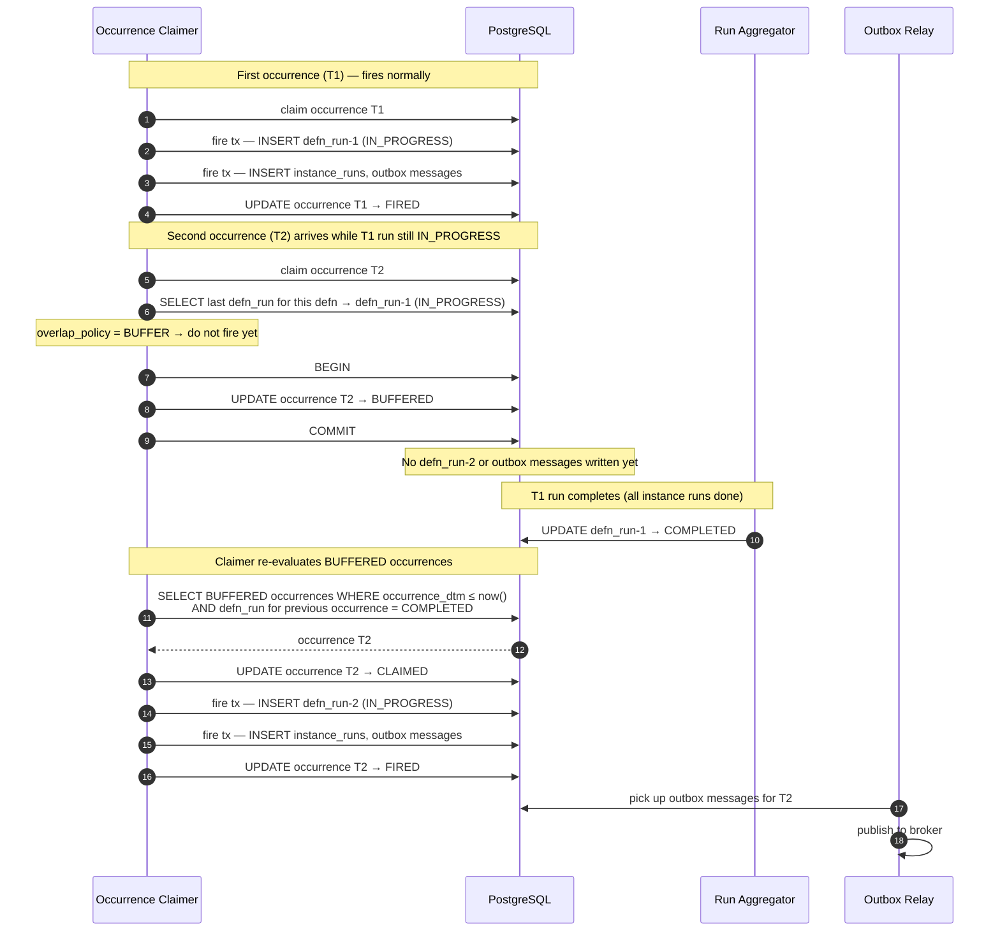
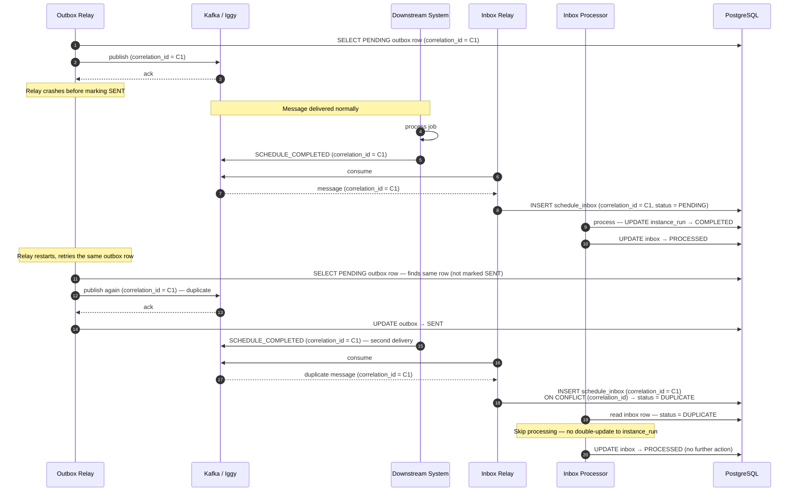

# Sequence Diagrams

## 1. Normal Fire — Happy Path

The end-to-end flow from occurrence generation through to defn-run completion.

---

## 2. Dead Worker Lease Recovery

A claimer pod crashes after claiming occurrences but before firing them. The Worker Coordinator detects the stale lease and reschedules the work.

---

## 3. Definition Version Upgrade

An operator updates a `schedule_defn`. Existing instances and in-flight runs are unaffected; the new version only governs future occurrences.

---

## 4. Overlap Policy — BUFFER

An occurrence fires while the previous run for the same definition is still `IN_PROGRESS`. Overlap policy is `BUFFER`.

---

## 5. Inbox Duplicate Detection

The Outbox Relay crashes after publishing to the broker but before marking the row `SENT`. The broker re-delivers. The Inbox Processor handles the duplicate safely.

